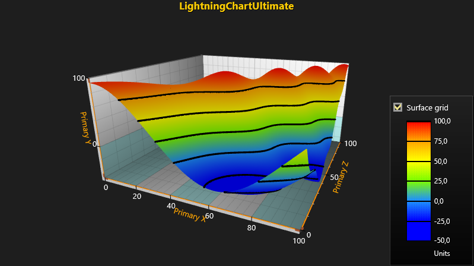

# Simple 3D SurfaceGrid Chart

*LightningChart* offers two different ways for representing data as 3D surface - *SurfaceGridSeries3D* and *SurfaceMeshSeries3D*.
In SurfaceGridSeries3D nodes are equally spaced in X and Z dimensions, where in *SurfaceMeshSeries3D* the nodes can be positioned freely in 3D space.

This tutorial shows how to create a simple 3D SurfaceGrid with wireframe and contour lines using *LightningChart SurfaceGridSeries3D*.   
SurfaceGrid allows visualizing data as a 3D surface and can be utilized for representing, measuring and examining data and it's variances.

Palette coloring is used in this tutorial for representing data in different colors according to it's values.
It is recommended to take a brief look into our [Heat Map](https://www.arction.com/tutorials/#/lcu_tutorial_2dHeatMaps_07) tutorial
where palette coloring is explained before continuing further with this tutorial.   



For this tutorial we predefine some variables for the purpose of easy usage and clearness.
Define the following variables inside your Form or MainWindow class as follows.

```csharp
/// <summary>
/// LightningChart component.
/// </summary>
private LightningChartUltimate _chart = null;

/// <summary>
/// Reference to SurfaceGrid series in chart.
/// </summary>
private SurfaceGridSeries3D _surfaceGrid = null;

/// <summary>
/// SurfaceGrid rows.
/// </summary>
int _rows = 500;

///<summary>
/// SurfaceGrid columns.
///</summary>
int _columns = 500;

/// <summary>
/// Minimum X-axis value.
/// </summary>
private const int MinX = 0;

/// <summary>
/// Maximum X-axis value.
/// </summary>
private const int MaxX = 100;

/// <summary>
/// Minimum Z-axis value.
/// </summary>
private const int MinZ = 0;

/// <summary>
/// Maximum Z-axis value.
/// </summary>
private const int MaxZ = 100;
```

##### 1. Define View3D as active view and define Y-axis range.
```csharp
// Set View3D as active view and set Y-axis range.
_chart.ActiveView = ActiveView.View3D;
_chart.View3D.YAxisPrimary3D.SetRange(-50, 100);
```

##### 2. Create a new SurfaceGrid instance as SurfaceGridSeries3D.
```csharp
// Create a new SurfaceGrid instance as SurfaceGridSeries3D.
_surfaceGrid = new SurfaceGridSeries3D(_chart.View3D, Axis3DBinding.Primary, Axis3DBinding.Primary, Axis3DBinding.Primary);
```

##### 3. Define settings for SurfaceGrid.
```csharp
// Set range, size and color saturation options for SurfaceGrid.
_surfaceGrid.RangeMinX = MinX;
_surfaceGrid.RangeMaxX = MaxX;
_surfaceGrid.RangeMinZ = MinZ;
_surfaceGrid.RangeMaxZ = MaxZ;
_surfaceGrid.SizeX = _columns;
_surfaceGrid.SizeZ = _rows;

// Stronger colors.
_surfaceGrid.ColorSaturation = 80; 
```

##### 4. Create ValueRangePalette and set it as a ContourPalette for SurfaceGrid.
```csharp
// Create ValueRangePalette for coloring SurfaceGrid's data.
ValueRangePalette palette = CreatePalette(_surfaceGrid);
_surfaceGrid.ContourPalette = palette;
```

##### 5. Define Wireframe and Contour lines for SurfaceGrid.
```csharp
// Define WireFrameType and ContourLineType for SurfaceGrid.
_surfaceGrid.WireframeType = SurfaceWireframeType3D.WireframePalettedByY;
_surfaceGrid.ContourLineType = ContourLineType3D.ColorLineByY;
_surfaceGrid.ContourLineWidth = 2;
```

##### 6. Generate data.
```csharp
 // Generate data.
public void GenerateData(int columns, int rows)
{
    // Create variable for storing data.
    double data = 0;

    // Disable rendering before updating chart properties to improve performance
    // and to prevent unnecessary chart redrawing while changing multiple properties.
    _chart.BeginUpdate();

    // Set data values and add them to SurfaceGrid.
    for (int i = 0; i < _columns; i++)
    {
        for (int j = 0; j < _rows; j++)
        {
            // Add values to the SurfaceGrid as SurfacePoints, points are distributed by using following function.
            data = 30.0 + 8 * Math.Cos(20 + 0.0001 * (double)(i * j)) + 60.0 * Math.Cos((double)(j - i) * 0.01);
            _surfaceGrid.Data[i, j].Y = data;
        }
    }

    // Notify chart about updated data.
    _surfaceGrid.InvalidateData();

    // Call EndUpdate to enable rendering again.
    _chart.EndUpdate();
}
```


